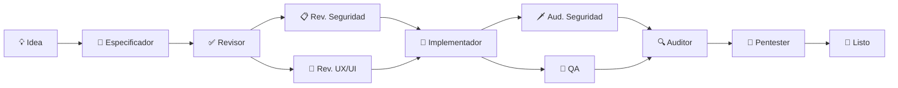

<p align="center">
  <sub>🌐 <a href="README.md">English</a> | <a href="README.pt.md">Português</a> | <a href="README.zh-cn.md">中文</a> | <a href="README.es.md">Español</a> | <a href="README.hi.md">हिन्दी</a></sub>
</p>

<p align="center">
  <h1 align="center">RightHand AI</h1>
  <p align="center">
    <strong>Asistente de IA local para desarrollo de software.</strong><br>
    Se ejecuta en tu máquina. Se conecta al LLM que elijas. <strong>Gratis.</strong>
  </p>
</p>

<p align="center">
  <a href="./download/"></a>
  <a href="./LICENSE"></a>
  
  
  
  <br>
  <sub>Autocontenido · Sin instalar .NET · 3 plataformas · 11 agentes especializados · 3 kits</sub>
</p>


---

<p align="center">
  <strong>⚡ 30 segundos para empezar:</strong>
  <br>
  <sub>Descarga el ZIP de tu plataforma → extrae → ejecuta el launcher → configura tu API key → listo.</sub>
</p>

---

## Qué hace diferente a RightHand AI

Mientras que otras herramientas ofrecen **un chat** o **autocompletado en el editor**, RightHand AI pone a trabajar en tu código un **equipo de agentes especializados** — cada uno con un rol específico en el ciclo de desarrollo.

| Herramienta | Modelo mental |
|-------------|---------------|
| ChatGPT, Claude | **Un asistente** genérico respondiendo preguntas |
| Copilot, Cursor, Windsurf | **Un piloto automático** sugiriendo código inline |
| **RightHand AI** | **Un equipo de ingeniería**: especificador, implementador, revisor, QA, auditor, pentester — colaborando de forma orquestrada |

> Ningún competidor ofrece un **pipeline completo** donde lo que un agente produce es automáticamente validado por el siguiente: el especificador crea la spec, el revisor aprueba, el implementador codifica, QA prueba, el auditor verifica y el pentester valida la seguridad.

---

## Descarga

| Plataforma | Descarga | Tamaño |
|------------|----------|:------:|
| 🪟 **Windows** 10/11 x64 | [`RightHandAi-win-x64.zip`](./download/RightHandAi-win-x64.zip) | ~80 MB |
| 🐧 **Linux** x64 | [`RightHandAi-linux-x64.zip`](./download/RightHandAi-linux-x64.zip) | ~80 MB |
| 🍎 **macOS** Apple Silicon | [`RightHandAi-osx-arm64.zip`](./download/RightHandAi-osx-arm64.zip) | ~80 MB |
| 🍎 **macOS** Intel | [`RightHandAi-osx-x64.zip`](./download/RightHandAi-osx-x64.zip) | ~80 MB |

| Requiere | No requiere |
|----------|-------------|
| Windows 10/11, Linux x64 o macOS | ❌ Instalar .NET |
| Clave de API (OpenAI, DeepSeek, etc.) | ❌ Registro en RightHand |
| ~300 MB en disco | ❌ Enviar código a la nube |

---

## Instalación

```bash
# Windows
Descarga el ZIP → extrae → ejecuta RightHandAi Desktop.bat

# Linux
Descarga el ZIP → extrae → chmod +x right-hand-ai.sh → ./right-hand-ai.sh

# macOS
Descarga el ZIP → extrae → ejecuta right-hand-ai.command
```
> 🍎 **Mac:** en la primera ejecución, clic derecho → Abrir. Después funciona directamente.

El navegador abre en `http://127.0.0.1:5821`.

---

## Primer uso

**1. Configura tu API key** (⚙️ esquina superior derecha). Ejemplo con DeepSeek (mejor relación costo-beneficio):

| Campo | Valor |
|-------|-------|
| Proveedor | DeepSeek |
| API Key | `sk-...` (tu clave) |
| Modelo | `deepseek-chat` |

**2. Abre una carpeta de proyecto.** La app detecta el stack automáticamente.

**3. Selecciona los agentes** en el panel de configuración. Puedes usar varios al mismo tiempo.

**4. Pide lo que quieras:**

> *"Crea una spec completa para un dashboard de métricas de ventas"*
>
> *"Revisa la seguridad de todos los endpoints de la API"*
>
> *"Audita la accesibilidad de las pantallas de registro y dime qué mejorar"*

---

## Agentes

### 📦 Construcción de Software

| Agente | Función |
|--------|---------|
| 📝 **Especificador** | Transforma ideas en especificaciones completas: requisitos funcionales, diseño técnico y tareas implementables — todo listo para ejecución |
| 🔨 **Implementador** | Ejecuta tareas de código. Hace `dotnet build` y `dotnet test` en cada paso. **Nunca avanza con build roto** |
| ✅ **Revisor de Spec** | Revisa especificaciones contra checklist de calidad: consistencia interna, cobertura de requisitos, cero ambigüedad |
| 🧪 **QA** | Genera y ejecuta pruebas automatizadas. Mapea cada criterio de aceptación a una prueba. **Cero brechas** |
| 🔍 **Auditor** | Verifica cada criterio de aceptación contra el código implementado. Clasificación binaria: ✅ o ❌. **Tolerancia cero** |

### 🛡️ Seguridad

| Agente | Función |
|--------|---------|
| 📋 **Revisor de Seguridad** | Audita specs y diseños **antes** de la implementación. Threat modeling ligero. "Las amenazas se tratan en el diseño, no en producción" |
| 🗡️ **Auditor de Seguridad** | Escanea código contra OWASP Top 10, secretos expuestos, SQL injection, XSS, auth bypass. Reporta archivo:línea |
| 🎯 **Pentester** | Simula ataques con payloads reales y genera pruebas automatizadas para validar que las defensas realmente funcionan |

### 🎨 Diseño y fundamentos

| Agente | Función |
|--------|---------|
| 🎨 **Revisor UX/UI** | Audita accesibilidad, consistencia visual, claridad, jerarquía, microcopy y usabilidad en toda la aplicación |
| ⚙️ **Setup SDD** | Configura la estructura del método automáticamente. Se ejecuta bajo demanda — el usuario ni siquiera necesita saber que existe |

---

## Pipeline de desarrollo



**Cada agente valida la salida del anterior.** El especificador no implementa, el auditor no especifica. Esto garantiza que cada etapa sea revisada desde una perspectiva independiente — como en un equipo real de ingeniería.

---

## 🔒 Privacidad

**Tus datos nunca salen de tu máquina.** La comunicación es directa entre la aplicación y el proveedor de IA que configuraste.

| RightHand NO hace | RightHand SÍ hace |
|-------------------|-------------------|
| ❌ Enviar código a un servidor intermedio | ✅ Conectar directo a la API del proveedor |
| ❌ Recopilar telemetría o analytics | ✅ Almacenar conversaciones localmente (SQLite) |
| ❌ Exigir registro o login | ✅ Funcionar 100% offline tras la configuración inicial |
| ❌ Compartir datos con terceros | ✅ Dejarte en control total |

---

## Proveedores soportados

| Proveedor | Modelos | Costo relativo |
|-----------|---------|:-------------:|
| **DeepSeek** | V3, R1, V4 | `$` |
| **OpenAI** | GPT-4o, GPT-4.1, GPT-5, o1, o3, o4-mini | `$$$` |
| **Anthropic** | Claude Opus 4, Sonnet 4 | `$$$` |
| **Google Gemini** | 2.5 Pro, 2.5 Flash | `$$` |
| **xAI** | Grok-3 | `$$` |
| **OpenAI-compatible** | Ollama, Groq, Together, Fireworks, etc. | `$` a `$$$` |

> 💡 **DeepSeek V4** ofrece calidad excelente para código por ~10x menos que los competidores premium. Ideal para implementación y revisión.

---

## Niveles de autonomía

Cada agente tiene un nivel configurable de control:

| 🔒 Lector | ✏️ Editor | 📝 Asistente | ⚡ Ejecutor |
|:---------:|:---------:|:------------:|:----------:|
| Lee archivos y responde | Crea/edita docs y configs | Propone cambios (requiere aprobación) | Aplica cambios y ejecuta comandos |

El valor predeterminado de cada agente es seguro. Ejemplo: Auditor de Seguridad = Lector (solo reporta), Implementador = Ejecutor (aplica código).

---

## Solución de problemas

| Problema | Haz esto |
|----------|----------|
| **"Connection refused"** | La app está iniciando. Espera 5 segundos y recarga `http://127.0.0.1:5821` |
| **Puerto 5821 ocupado** | Cierra otra instancia o cambia el puerto en configuración |
| **"Invalid API Key"** | Verifica que copiaste la clave sin espacios extra. Genera una nueva en el panel del proveedor |
| **Respuestas lentas** | Cambia a un modelo más rápido: `deepseek-chat` o `gpt-4o-mini` |
| **Agente no aparece** | Abre una carpeta de proyecto — algunos agentes requieren workspace |
| **Build roto** | El Implementador lo corrige solo. Pide "corrige el build" si se atasca |
| 🍎 **macOS: "no se puede verificar"** | Normal la primera vez. Clic derecho → **Abrir**. Después funciona directo |
| 🐧 **Linux/macOS: permiso denegado** | `chmod +x right-hand-ai.sh` (o `.command`) |

---

## Desinstalación

**Windows:** Agregar o quitar programas → RightHand AI.  
**Linux/macOS:** Elimina la carpeta de la aplicación.

Tus datos se conservan. Para eliminarlos, borra la carpeta indicada abajo:

| SO | Carpeta de datos |
|----|------------------|
| Windows | `%LocalAppData%\RightHandAi\` |
| Linux | `~/.local/share/RightHandAi/` |
| macOS | `~/Library/Application Support/RightHandAi/` |

---

<p align="center">
  <strong>RightHand AI 1.1.0</strong> · Mayo 2026<br>
  <sub>Gratis. Multiplataforma. Sin registro. Sin telemetría.</sub>
</p>
