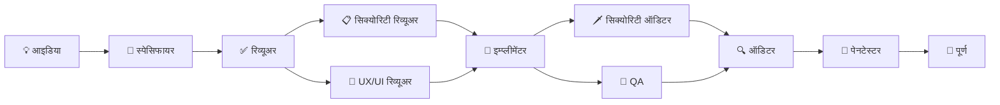

<p align="center">
  <sub>🌐 <a href="README.md">English</a> | <a href="README.pt.md">Português</a> | <a href="README.zh-cn.md">中文</a> | <a href="README.es.md">Español</a> | <a href="README.hi.md">हिन्दी</a></sub>
</p>

<p align="center">
  <h1 align="center">RightHand AI</h1>
  <p align="center">
    <strong>सॉफ्टवेयर डेवलपमेंट के लिए लोकल AI असिस्टेंट।</strong><br>
    आपकी मशीन पर चलता है। आपकी पसंद के LLM से जुड़ता है। <strong>मुफ्त।</strong>
  </p>
</p>

<p align="center">
  <a href="./download/"></a>
  <a href="./LICENSE"></a>
  
  
  
  <br>
  <sub>सेल्फ-कंटेंड · .NET इंस्टॉल की जरूरत नहीं · 3 प्लेटफॉर्म · 11 विशेषज्ञ एजेंट · 3 किट</sub>
</p>


---

<p align="center">
  <strong>⚡ शुरू करने में सिर्फ 30 सेकंड:</strong>
  <br>
  <sub>अपने प्लेटफॉर्म का ZIP डाउनलोड करें → एक्सट्रैक्ट करें → लॉन्चर चलाएं → API की सेट करें → हो गया।</sub>
</p>

---

## RightHand AI को क्या अलग बनाता है

जहां दूसरे टूल **एक चैट** या **एडिटर ऑटोकम्पलीट** देते हैं, वहीं RightHand AI आपके कोड पर काम करने के लिए **विशेषज्ञ एजेंटों की एक टीम** तैनात करता है — हर एक की डेवलपमेंट साइकिल में एक खास भूमिका होती है।

| टूल | मानसिक मॉडल |
|------|-------------|
| ChatGPT, Claude | सवालों के जवाब देने वाला **एक सामान्य असिस्टेंट** |
| Copilot, Cursor, Windsurf | इनलाइन कोड सुझाने वाला **एक ऑटोपायलट** |
| **RightHand AI** | **एक इंजीनियरिंग टीम**: स्पेसिफायर, इम्प्लीमेंटर, रिव्यूअर, QA, ऑडिटर, पेनटेस्टर — ऑर्केस्ट्रेटेड तरीके से सहयोग करते हुए |

> कोई भी प्रतिस्पर्धी **पूरी पाइपलाइन** नहीं देता जहां एक एजेंट का आउटपुट अपने आप अगले एजेंट से वैलिडेट होता है: स्पेसिफायर स्पेक बनाता है, रिव्यूअर मंजूर करता है, इम्प्लीमेंटर कोड करता है, QA टेस्ट करता है, ऑडिटर वेरिफाई करता है और पेनटेस्टर सुरक्षा की पुष्टि करता है।

---

## डाउनलोड

| प्लेटफॉर्म | डाउनलोड | आकार |
|------------|----------|:---:|
| 🪟 **Windows** 10/11 x64 | [`RightHandAi-win-x64.zip`](./download/RightHandAi-win-x64.zip) | ~80 MB |
| 🐧 **Linux** x64 | [`RightHandAi-linux-x64.zip`](./download/RightHandAi-linux-x64.zip) | ~80 MB |
| 🍎 **macOS** Apple Silicon | [`RightHandAi-osx-arm64.zip`](./download/RightHandAi-osx-arm64.zip) | ~80 MB |
| 🍎 **macOS** Intel | [`RightHandAi-osx-x64.zip`](./download/RightHandAi-osx-x64.zip) | ~80 MB |

| जरूरत है | जरूरत नहीं है |
|----------|---------------|
| Windows 10/11, Linux x64 या macOS | ❌ .NET इंस्टॉल करना |
| API की (OpenAI, DeepSeek, आदि) | ❌ RightHand अकाउंट |
| ~300 MB डिस्क स्पेस | ❌ कोड को क्लाउड पर भेजना |

---

## इंस्टॉलेशन

```bash
# Windows
ZIP डाउनलोड करें → एक्सट्रैक्ट करें → RightHandAi Desktop.bat चलाएं

# Linux
ZIP डाउनलोड करें → एक्सट्रैक्ट करें → chmod +x right-hand-ai.sh → ./right-hand-ai.sh

# macOS
ZIP डाउनलोड करें → एक्सट्रैक्ट करें → right-hand-ai.command चलाएं
```
> 🍎 **Mac:** पहली बार चलाने पर, राइट-क्लिक → Open। उसके बाद सीधे काम करता है।

आपका ब्राउज़र `http://127.0.0.1:5821` पर खुलता है।

---

## पहला उपयोग

**1. अपनी API की कॉन्फ़िगर करें** (⚙️ ऊपर दाएं कोने में)। DeepSeek के साथ उदाहरण (सबसे अच्छा लागत-लाभ):

| फील्ड | मान |
|-------|------|
| प्रोवाइडर | DeepSeek |
| API Key | `sk-...` (आपकी की) |
| मॉडल | `deepseek-chat` |

**2. एक प्रोजेक्ट फोल्डर खोलें।** ऐप अपने आप स्टैक पहचान लेता है।

**3. सेटिंग्स पैनल में एजेंट चुनें।** एक साथ कई का उपयोग कर सकते हैं।

**4. जो चाहें पूछें:**

> *"एक सेल्स मेट्रिक्स डैशबोर्ड के लिए पूरी स्पेक बनाओ"*
>
> *"सभी API एंडपॉइंट्स की सुरक्षा की समीक्षा करो"*
>
> *"रजिस्ट्रेशन स्क्रीन की एक्सेसिबिलिटी ऑडिट करो और बताओ क्या सुधारना है"*

---

## एजेंट

### 📦 सॉफ्टवेयर निर्माण

| एजेंट | भूमिका |
|--------|--------|
| 📝 **स्पेसिफायर** | विचारों को पूर्ण स्पेसिफिकेशन में बदलता है: फंक्शनल रिक्वायरमेंट्स, टेक्निकल डिज़ाइन और इम्प्लीमेंटेबल टास्क — सब कुछ एक्जीक्यूशन के लिए तैयार |
| 🔨 **इम्प्लीमेंटर** | कोड टास्क एक्जीक्यूट करता है। हर कदम पर `dotnet build` और `dotnet test` चलाता है। **टूटे बिल्ड के साथ कभी आगे नहीं बढ़ता** |
| ✅ **स्पेक रिव्यूअर** | क्वालिटी चेकलिस्ट के खिलाफ स्पेसिफिकेशन की समीक्षा करता है: आंतरिक स्थिरता, रिक्वायरमेंट कवरेज, शून्य अस्पष्टता |
| 🧪 **QA** | ऑटोमेटेड टेस्ट जनरेट और चलाता है। हर एक्सेप्टेंस क्राइटेरिया को एक टेस्ट से मैप करता है। **शून्य अंतराल** |
| 🔍 **ऑडिटर** | इम्प्लीमेंटेड कोड के खिलाफ हर एक्सेप्टेंस क्राइटेरिया की पुष्टि करता है। बाइनरी क्लासिफिकेशन: ✅ या ❌। **शून्य सहनशीलता** |

### 🛡️ सुरक्षा

| एजेंट | भूमिका |
|--------|--------|
| 📋 **सिक्योरिटी रिव्यूअर** | इम्प्लीमेंटेशन से **पहले** स्पेक और डिज़ाइन का ऑडिट करता है। हल्का थ्रेट मॉडलिंग। "खतरे डिज़ाइन में संभाले जाते हैं, प्रोडक्शन में नहीं" |
| 🗡️ **सिक्योरिटी ऑडिटर** | OWASP Top 10, एक्सपोज़्ड सीक्रेट्स, SQL इंजेक्शन, XSS, ऑथ बायपास के खिलाफ कोड स्कैन करता है। फाइल:लाइन रिपोर्ट करता है |
| 🎯 **पेनटेस्टर** | असली पेलोड के साथ हमलों का अनुकरण करता है और यह मान्य करने के लिए ऑटोमेटेड टेस्ट जनरेट करता है कि डिफेंस वास्तव में काम करते हैं या नहीं |

### 🎨 डिज़ाइन और बुनियाद

| एजेंट | भूमिका |
|--------|--------|
| 🎨 **UX/UI रिव्यूअर** | पूरे एप्लिकेशन में एक्सेसिबिलिटी, विजुअल कंसिस्टेंसी, स्पष्टता, हायरार्की, माइक्रोकॉपी और यूजेबिलिटी का ऑडिट करता है |
| ⚙️ **SDD सेटअप** | मेथड स्ट्रक्चर अपने आप कॉन्फ़िगर करता है। डिमांड पर चलता है — यूजर को पता भी नहीं चलता कि यह मौजूद है |

---

## डेवलपमेंट पाइपलाइन



**हर एजेंट पिछले एजेंट के आउटपुट को मान्य करता है।** स्पेसिफायर इम्प्लीमेंट नहीं करता, ऑडिटर स्पेसिफाई नहीं करता। यह सुनिश्चित करता है कि हर कदम एक स्वतंत्र दृष्टिकोण से समीक्षा की जाए — बिल्कुल एक असली इंजीनियरिंग टीम की तरह।

---

## 🔒 प्राइवेसी

**आपका डेटा कभी आपकी मशीन नहीं छोड़ता।** कम्युनिकेशन सीधे ऐप और आपके द्वारा कॉन्फ़िगर किए गए AI प्रोवाइडर के बीच होता है।

| RightHand यह नहीं करता | RightHand यह करता है |
|------------------------|----------------------|
| ❌ कोड को बीच के सर्वर पर भेजना | ✅ सीधे प्रोवाइडर की API से कनेक्ट करना |
| ❌ टेलीमेट्री या एनालिटिक्स इकट्ठा करना | ✅ बातचीत को लोकली स्टोर करना (SQLite) |
| ❌ रजिस्ट्रेशन या लॉगिन की मांग करना | ✅ शुरुआती सेटअप के बाद 100% ऑफलाइन चलना |
| ❌ तीसरे पक्षों के साथ डेटा शेयर करना | ✅ आपको पूर्ण नियंत्रण में रखना |

---

## समर्थित प्रोवाइडर

| प्रोवाइडर | मॉडल | सापेक्ष लागत |
|-----------|-------|:----------:|
| **DeepSeek** | V3, R1, V4 | `$` |
| **OpenAI** | GPT-4o, GPT-4.1, GPT-5, o1, o3, o4-mini | `$$$` |
| **Anthropic** | Claude Opus 4, Sonnet 4 | `$$$` |
| **Google Gemini** | 2.5 Pro, 2.5 Flash | `$$` |
| **xAI** | Grok-3 | `$$` |
| **OpenAI-कम्पैटिबल** | Ollama, Groq, Together, Fireworks, आदि | `$` से `$$$` |

> 💡 **DeepSeek V4** प्रीमियम प्रतिस्पर्धियों से ~10x कम कीमत पर शानदार कोड क्वालिटी देता है। इम्प्लीमेंटेशन और समीक्षा के लिए आदर्श।

---

## स्वायत्तता स्तर

हर एजेंट का एक कॉन्फ़िगरेबल नियंत्रण स्तर है:

| 🔒 रीडर | ✏️ एडिटर | 📝 असिस्टेंट | ⚡ एक्जीक्यूटर |
|:-------:|:-------:|:----------:|:----------:|
| फाइलें पढ़ता है और जवाब देता है | डॉक्स और कॉन्फ़िग बनाता/एडिट करता है | बदलाव प्रस्तावित करता है (अनुमोदन जरूरी) | बदलाव लागू करता है और कमांड चलाता है |

हर एजेंट का डिफ़ॉल्ट सुरक्षित है। उदाहरण: सिक्योरिटी ऑडिटर = रीडर (केवल रिपोर्ट करता है), इम्प्लीमेंटर = एक्जीक्यूटर (कोड लागू करता है)।

---

## समस्या निवारण

| समस्या | यह करें |
|---------|---------|
| **"Connection refused"** | ऐप शुरू हो रहा है। 5 सेकंड रुकें और `http://127.0.0.1:5821` रीलोड करें |
| **पोर्ट 5821 उपयोग में है** | दूसरा इंस्टेंस बंद करें या सेटिंग्स में पोर्ट बदलें |
| **"Invalid API Key"** | जांचें कि की बिना अतिरिक्त स्पेस के कॉपी की है। प्रोवाइडर के डैशबोर्ड में नई की जनरेट करें |
| **धीमी प्रतिक्रिया** | तेज़ मॉडल पर स्विच करें: `deepseek-chat` या `gpt-4o-mini` |
| **एजेंट नहीं दिख रहा** | प्रोजेक्ट फोल्डर खोलें — कुछ एजेंटों को वर्कस्पेस की जरूरत होती है |
| **टूटा हुआ बिल्ड** | इम्प्लीमेंटर खुद ठीक करता है। अटकने पर "बिल्ड ठीक करो" कहें |
| 🍎 **macOS: "सत्यापित नहीं किया जा सकता"** | पहली बार सामान्य है। राइट-क्लिक → **Open**। उसके बाद सीधे काम करता है |
| 🐧 **Linux/macOS: अनुमति अस्वीकृत** | `chmod +x right-hand-ai.sh` (या `.command`) |

---

## अनइंस्टॉल

**Windows:** Add or Remove Programs → RightHand AI।  
**Linux/macOS:** एप्लिकेशन फोल्डर हटा दें।

आपका डेटा सुरक्षित रहता है। उसे हटाने के लिए, नीचे बताया गया फोल्डर डिलीट करें:

| OS | डेटा फोल्डर |
|----|-------------|
| Windows | `%LocalAppData%\RightHandAi\` |
| Linux | `~/.local/share/RightHandAi/` |
| macOS | `~/Library/Application Support/RightHandAi/` |

---

<p align="center">
  <strong>RightHand AI 1.1.0</strong> · मई 2026<br>
  <sub>मुफ्त। मल्टी-प्लेटफॉर्म। कोई रजिस्ट्रेशन नहीं। कोई टेलीमेट्री नहीं।</sub>
</p>
