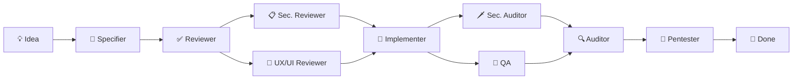

<p align="center">
  <sub>🌐 <a href="README.md">English</a> | <a href="README.pt.md">Português</a> | <a href="README.zh-cn.md">中文</a> | <a href="README.es.md">Español</a> | <a href="README.hi.md">हिन्दी</a></sub>
</p>

<p align="center">
  <h1 align="center">RightHand AI</h1>
  <p align="center">
    <strong>Local AI assistant for software development.</strong><br>
    Runs on your machine. Connects to the LLM you choose. <strong>Free.</strong>
  </p>
</p>

<p align="center">
  <a href="./download/"></a>
  <a href="./LICENSE"></a>
  
  
  
  <br>
  <sub>Self-contained · No .NET install · 3 platforms · 11 specialized agents · 3 kits</sub>
</p>


---

<p align="center">
  <strong>⚡ 30 seconds to get started:</strong>
  <br>
  <sub>Download your platform ZIP → extract → run the launcher → set your API key → done.</sub>
</p>

---

## What makes RightHand AI different

While other tools offer **a chat** or **editor autocomplete**, RightHand AI puts a **team of specialized agents** to work on your code — each with a specific role in the development cycle.

| Tool | Mental model |
|------|-------------|
| ChatGPT, Claude | **A generic assistant** answering questions |
| Copilot, Cursor, Windsurf | **An autopilot** suggesting inline code |
| **RightHand AI** | **An engineering team**: specifier, implementer, reviewer, QA, auditor, pentester — collaborating in orchestrated fashion |

> No competitor offers a **complete pipeline** where what one agent produces is automatically validated by the next: the specifier creates the spec, the reviewer approves it, the implementer codes it, QA tests it, the auditor verifies it, and the pentester validates security.

---

## Download

| Platform | Download | Size |
|----------|----------|:----:|
| 🪟 **Windows** 10/11 x64 | [`RightHandAi-win-x64.zip`](./download/RightHandAi-win-x64.zip) | ~80 MB |
| 🐧 **Linux** x64 | [`RightHandAi-linux-x64.zip`](./download/RightHandAi-linux-x64.zip) | ~80 MB |
| 🍎 **macOS** Apple Silicon | [`RightHandAi-osx-arm64.zip`](./download/RightHandAi-osx-arm64.zip) | ~80 MB |
| 🍎 **macOS** Intel | [`RightHandAi-osx-x64.zip`](./download/RightHandAi-osx-x64.zip) | ~80 MB |

| Requires | Does NOT require |
|----------|------------------|
| Windows 10/11, Linux x64, or macOS | ❌ Installing .NET |
| API key (OpenAI, DeepSeek, etc.) | ❌ RightHand account |
| ~300 MB disk space | ❌ Sending code to the cloud |

---

## Installation

```bash
# Windows
Download the ZIP → extract → run RightHandAi Desktop.bat

# Linux
Download the ZIP → extract → chmod +x right-hand-ai.sh → ./right-hand-ai.sh

# macOS
Download the ZIP → extract → run right-hand-ai.command
```
> 🍎 **Mac:** on first launch, right-click → Open. After that it works directly.

Your browser opens at `http://127.0.0.1:5821`.

---

## First use

**1. Configure your API key** (⚙️ top-right corner). Example with DeepSeek (best cost-benefit):

| Field | Value |
|-------|-------|
| Provider | DeepSeek |
| API Key | `sk-...` (your key) |
| Model | `deepseek-chat` |

**2. Open a project folder.** The app auto-detects the stack.

**3. Select agents** in the settings panel. You can use multiple at once.

**4. Ask anything:**

> *"Create a complete spec for a sales metrics dashboard"*
>
> *"Review the security of all API endpoints"*
>
> *"Audit the accessibility of the registration screens and tell me what to improve"*

---

## Agents

### 📦 Software Construction

| Agent | Role |
|-------|------|
| 📝 **Specifier** | Transforms ideas into complete specifications: functional requirements, technical design, and implementable tasks — all ready for execution |
| 🔨 **Implementer** | Executes code tasks. Runs `dotnet build` and `dotnet test` at every step. **Never advances with a broken build** |
| ✅ **Spec Reviewer** | Reviews specifications against a quality checklist: internal consistency, requirement coverage, zero ambiguity |
| 🧪 **QA** | Generates and runs automated tests. Maps each acceptance criterion to a test. **Zero gaps** |
| 🔍 **Auditor** | Verifies each acceptance criterion against the implemented code. Binary classification: ✅ or ❌. **Zero tolerance** |

### 🛡️ Security

| Agent | Role |
|-------|------|
| 📋 **Security Reviewer** | Audits specs and designs **before** implementation. Lightweight threat modeling. "Threats are handled at design time, not in production" |
| 🗡️ **Security Auditor** | Scans code against OWASP Top 10, exposed secrets, SQL injection, XSS, auth bypass. Reports file:line |
| 🎯 **Pentester** | Simulates attacks with real payloads and generates automated tests to validate that defenses actually work |

### 🎨 Design & Foundations

| Agent | Role |
|-------|------|
| 🎨 **UX/UI Reviewer** | Audits accessibility, visual consistency, clarity, hierarchy, microcopy, and usability across the entire application |
| ⚙️ **SDD Setup** | Configures the method structure automatically. Runs on demand — the user doesn't even need to know it exists |

---

## Development Pipeline



**Each agent validates the previous agent's output.** The specifier doesn't implement, the auditor doesn't specify. This ensures each step is reviewed from an independent perspective — like a real engineering team.

---

## 🔒 Privacy

**Your data never leaves your machine.** Communication is direct between the app and the AI provider you configured.

| RightHand DOES NOT | RightHand DOES |
|--------------------|----------------|
| ❌ Send code to an intermediate server | ✅ Connect directly to the provider's API |
| ❌ Collect telemetry or analytics | ✅ Store conversations locally (SQLite) |
| ❌ Require registration or login | ✅ Run 100% offline after initial setup |
| ❌ Share data with third parties | ✅ Keep you in full control |

---

## Supported Providers

| Provider | Models | Relative cost |
|----------|--------|:------------:|
| **DeepSeek** | V3, R1, V4 | `$` |
| **OpenAI** | GPT-4o, GPT-4.1, GPT-5, o1, o3, o4-mini | `$$$` |
| **Anthropic** | Claude Opus 4, Sonnet 4 | `$$$` |
| **Google Gemini** | 2.5 Pro, 2.5 Flash | `$$` |
| **xAI** | Grok-3 | `$$` |
| **OpenAI-compatible** | Ollama, Groq, Together, Fireworks, etc. | `$` to `$$$` |

> 💡 **DeepSeek V4** delivers excellent code quality for ~10x less than premium competitors. Ideal for implementation and review.

---

## Autonomy Levels

Each agent has a configurable control level:

| 🔒 Reader | ✏️ Editor | 📝 Assistant | ⚡ Executor |
|:---------:|:---------:|:------------:|:----------:|
| Reads files and responds | Creates/edits docs and configs | Proposes changes (requires approval) | Applies changes and runs commands |

Each agent's default is safe. Example: Security Auditor = Reader (reports only), Implementer = Executor (applies code).

---

## Troubleshooting

| Problem | Do this |
|---------|---------|
| **"Connection refused"** | App is starting. Wait 5 seconds and reload `http://127.0.0.1:5821` |
| **Port 5821 in use** | Close another instance or change the port in settings |
| **"Invalid API Key"** | Make sure you copied the key without extra spaces. Generate a new one in your provider's dashboard |
| **Slow responses** | Switch to a faster model: `deepseek-chat` or `gpt-4o-mini` |
| **Agent not showing up** | Open a project folder — some agents require a workspace |
| **Broken build** | The Implementer fixes itself. Ask "fix the build" if stuck |
| 🍎 **macOS: "cannot be verified"** | Normal on first launch. Right-click → **Open**. Works directly after that |
| 🐧 **Linux/macOS: permission denied** | `chmod +x right-hand-ai.sh` (or `.command`) |

---

## Uninstall

**Windows:** Add or Remove Programs → RightHand AI.  
**Linux/macOS:** Remove the application folder.

Your data is preserved. To remove it, delete the folder indicated below:

| OS | Data folder |
|----|-------------|
| Windows | `%LocalAppData%\RightHandAi\` |
| Linux | `~/.local/share/RightHandAi/` |
| macOS | `~/Library/Application Support/RightHandAi/` |

---

<p align="center">
  <strong>RightHand AI 1.1.0</strong> · May 2026<br>
  <sub>Free. Multi-platform. No registration. No telemetry.</sub>
</p>
