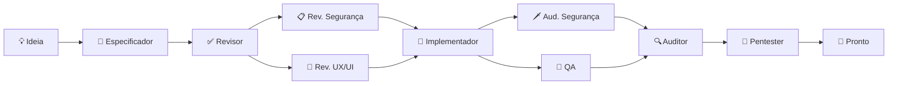

<p align="center">
  <h1 align="center">RightHand AI</h1>
  <p align="center">
    <strong>Assistente de IA local para desenvolvimento de software.</strong><br>
    Roda na sua máquina. Conecta ao LLM que você escolher. <strong>Grátis.</strong>
  </p>
</p>

<p align="center">
  <a href="./download/"></a>
  <a href="./LICENSE"></a>
  
  
  
  <br>
  <sub>Self-contained · Sem instalar .NET · 3 plataformas · 11 agentes especializados · 3 kits</sub>
</p>


---

<p align="center">
  <strong>⚡ 30 segundos para começar:</strong>
  <br>
  <sub>Baixe o ZIP da sua plataforma → descompacte → execute o launcher → configure sua API key → pronto.</sub>
</p>

---

## O que faz o RightHand AI diferente

Enquanto outras ferramentas oferecem **um chat** ou **autocomplete no editor**, o RightHand AI coloca um **time de agentes especializados** para trabalhar no seu código — cada um com um papel específico no ciclo de desenvolvimento.

| Ferramenta | Modelo mental |
|------------|---------------|
| ChatGPT, Claude | **Um assistente** genérico respondendo perguntas |
| Copilot, Cursor, Windsurf | **Um piloto automático** sugerindo código inline |
| **RightHand AI** | **Um time de engenharia**: especificador, implementador, revisor, QA, auditor, pentester — colaborando orquestradamente |

> Nenhum concorrente oferece um **pipeline completo** onde o que um agente produz é automaticamente validado pelo seguinte: o especificador cria a spec, o revisor aprova, o implementador codifica, o QA testa, o auditor verifica e o pentester valida a segurança.

---

## Download

| Plataforma | Download | Tamanho |
|------------|----------|:-------:|
| 🪟 **Windows** 10/11 x64 | [`RightHandAi-win-x64.zip`](./download/RightHandAi-win-x64.zip) | ~80 MB |
| 🐧 **Linux** x64 | [`RightHandAi-linux-x64.zip`](./download/RightHandAi-linux-x64.zip) | ~80 MB |
| 🍎 **macOS** Apple Silicon | [`RightHandAi-osx-arm64.zip`](./download/RightHandAi-osx-arm64.zip) | ~80 MB |
| 🍎 **macOS** Intel | [`RightHandAi-osx-x64.zip`](./download/RightHandAi-osx-x64.zip) | ~80 MB |

| Requer | Não requer |
|--------|------------|
| Windows 10/11, Linux x64 ou macOS | ❌ Instalar .NET |
| Chave de API (OpenAI, DeepSeek, etc.) | ❌ Cadastro no RightHand |
| ~300 MB em disco | ❌ Enviar código para nuvem |

---

## Instalação

```bash
# Windows
Baixe o ZIP → descompacte → execute RightHandAi Desktop.bat

# Linux
Baixe o ZIP → descompacte → chmod +x right-hand-ai.sh → ./right-hand-ai.sh

# macOS
Baixe o ZIP → descompacte → execute right-hand-ai.command
```
> 🍎 **Mac:** na primeira execução, botão direito → Abrir. Depois funciona direto.

O navegador abre em `http://127.0.0.1:5821`.

---

## Primeiro uso

**1. Configure sua API key** (⚙️ canto superior direito). Exemplo com DeepSeek (melhor custo-benefício):

| Campo | Valor |
|-------|-------|
| Provedor | DeepSeek |
| API Key | `sk-...` (sua chave) |
| Modelo | `deepseek-chat` |

**2. Abra uma pasta de projeto.** O app detecta a stack automaticamente.

**3. Selecione os agentes** no painel de configurações. Pode usar vários ao mesmo tempo.

**4. Peça o que quiser:**

> *"Crie uma spec completa para um dashboard de métricas de vendas"*
>
> *"Revise a segurança de todos os endpoints da API"*
>
> *"Audite a acessibilidade das telas de cadastro e me diga o que melhorar"*

---

## Agentes

### 📦 Construção de Software

| Agente | Função |
|--------|--------|
| 📝 **Especificador** | Transforma ideias em especificações completas: requisitos funcionais, design técnico e tarefas implementáveis — tudo pronto para execução |
| 🔨 **Implementador** | Executa tarefas de código. Faz `dotnet build` e `dotnet test` a cada etapa. **Nunca avança com build quebrado** |
| ✅ **Revisor Spec** | Revisa especificações contra checklist de qualidade: consistência interna, cobertura de requisitos, zero ambiguidade |
| 🧪 **QA** | Gera e executa testes automatizados. Mapeia cada critério de aceite para um teste. **Zero gaps** |
| 🔍 **Auditor** | Verifica cada critério de aceite contra o código implementado. Classificação binária: ✅ ou ❌. **Tolerância zero** |

### 🛡️ Segurança

| Agente | Função |
|--------|--------|
| 📋 **Revisor de Segurança** | Audita specs e designs **antes** da implementação. Threat modeling leve. "Ameaças se tratam no design, não em produção" |
| 🗡️ **Auditor de Segurança** | Varre código contra OWASP Top 10, secrets expostos, SQL injection, XSS, auth bypass. Reporta arquivo:linha |
| 🎯 **Pentester** | Simula ataques com payloads reais e gera testes automatizados para validar se as defesas realmente funcionam |

### 🎨 Design e fundamentos

| Agente | Função |
|--------|--------|
| 🎨 **Revisor UX/UI** | Audita acessibilidade, consistência visual, clareza, hierarquia, microcopy e usabilidade em toda a aplicação |
| ⚙️ **Setup SDD** | Configura a estrutura do método automaticamente. Executado sob demanda — o usuário nem precisa saber que ele existe |

---

## Pipeline de desenvolvimento



**Cada agente valida a saída do anterior.** O especificador não implementa, o auditor não especifica. Isso garante que cada etapa seja revisada por uma perspectiva independente — como num time real de engenharia.

---

## 🔒 Privacidade

**Seus dados nunca saem da sua máquina.** A comunicação é direta entre o aplicativo e o provedor de IA que você configurou.

| O RightHand NÃO faz | O RightHand FAZ |
|---------------------|-----------------|
| ❌ Enviar código para servidor intermediário | ✅ Conectar direto na API do provedor |
| ❌ Coletar telemetria ou analytics | ✅ Armazenar conversas localmente (SQLite) |
| ❌ Exigir cadastro ou login | ✅ Rodar 100% offline após o primeiro setup |
| ❌ Compartilhar dados com terceiros | ✅ Deixar você no controle total |

---

## Provedores suportados

| Provedor | Modelos | Custo relativo |
|----------|---------|:--------------:|
| **DeepSeek** | V3, R1, V4 | `$` |
| **OpenAI** | GPT-4o, GPT-4.1, GPT-5, o1, o3, o4-mini | `$$$` |
| **Anthropic** | Claude Opus 4, Sonnet 4 | `$$$` |
| **Google Gemini** | 2.5 Pro, 2.5 Flash | `$$` |
| **xAI** | Grok-3 | `$$` |
| **OpenAI-compatible** | Ollama, Groq, Together, Fireworks, etc. | `$` a `$$$` |

> 💡 **DeepSeek V4** entrega qualidade excelente para código por ~10x menos que os concorrentes premium. Ideal para implementação e revisão.

---

## Níveis de autonomia

Cada agente tem um nível configurável de controle:

| 🔒 Leitor | ✏️ Editor | 📝 Assistente | ⚡ Executor |
|:---------:|:---------:|:------------:|:----------:|
| Lê arquivos e responde | Cria/edita docs e configs | Propõe mudanças (requer aprovação) | Aplica mudanças e executa comandos |

O padrão de cada agente é seguro. Exemplo: Auditor de Segurança = Leitor (só reporta), Implementador = Executor (aplica código).

---

## Solução de problemas

| Problema | Faça isto |
|----------|-----------|
| **"Connection refused"** | App está iniciando. Aguarde 5 segundos e recarregue `http://127.0.0.1:5821` |
| **Porta 5821 ocupada** | Feche outra instância ou altere a porta nas configurações |
| **"Invalid API Key"** | Confira se copiou a chave sem espaços extras. Gere uma nova no painel do provedor |
| **Respostas lentas** | Troque para modelo mais rápido: `deepseek-chat` ou `gpt-4o-mini` |
| **Agente não aparece** | Abra uma pasta de projeto — alguns agentes exigem workspace |
| **Build quebrado** | O Implementador corrige sozinho. Peça "corrija o build" se travar |
| 🍎 **macOS: "não é possível verificar"** | Normal na 1ª vez. Botão direito → **Abrir**. Depois funciona direto |
| 🐧 **Linux/macOS: permissão negada** | `chmod +x right-hand-ai.sh` (ou `.command`) |

---

## Desinstalação

**Windows:** Adicionar ou remover programas → RightHand AI.  
**Linux/macOS:** Remova a pasta do aplicativo.

Seus dados ficam preservados. Para removê-los, apague a pasta indicada abaixo:

| SO | Pasta de dados |
|----|----------------|
| Windows | `%LocalAppData%\RightHandAi\` |
| Linux | `~/.local/share/RightHandAi/` |
| macOS | `~/Library/Application Support/RightHandAi/` |

---

<p align="center">
  <strong>RightHand AI 1.1.0</strong> · Maio 2026<br>
  <sub>Grátis. Multi-plataforma. Sem cadastro. Sem telemetria.</sub>
</p>
