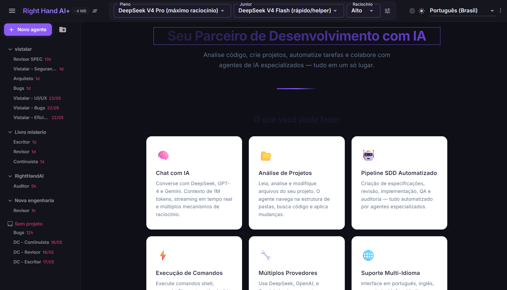
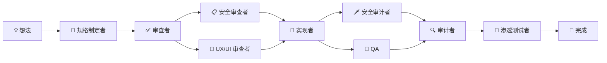

<p align="center">
  <sub>🌐 <a href="README.md">English</a> | <a href="README.pt.md">Português</a> | <a href="README.zh-cn.md">中文</a> | <a href="README.es.md">Español</a> | <a href="README.hi.md">हिन्दी</a></sub>
</p>

<p align="center">
  <h1 align="center">RightHand AI</h1>
  <p align="center">
    <strong>用于软件开发的本地 AI 助手。</strong><br>
    在你的机器上运行。连接到你选择的 LLM。<strong>免费。</strong>
  </p>
</p>

<p align="center">
  <a href="./download/"></a>
  <a href="./LICENSE"></a>
  
  
  
  <br>
  <sub>独立运行 · 无需安装 .NET · 3 个平台 · 11 个专业代理 · 3 个工具包</sub>
</p>



---

<p align="center">
  <strong>⚡ 30 秒即可开始：</strong>
  <br>
  <sub>下载对应平台的 ZIP → 解压 → 运行启动器 → 配置 API 密钥 → 完成。</sub>
</p>

---

## RightHand AI 有何不同

其他工具提供**一个聊天**或**编辑器自动补全**，而 RightHand AI 则部署一个**由专业代理组成的团队**来处理你的代码——每个代理在开发周期中都有特定的角色。

| 工具 | 心智模型 |
|------|---------|
| ChatGPT、Claude | 回答问题的**通用助手** |
| Copilot、Cursor、Windsurf | 建议内联代码的**自动驾驶仪** |
| **RightHand AI** | **一个工程团队**：规格制定者、实现者、审查者、QA、审计者、渗透测试者——协同工作 |

> 没有其他竞争对手提供**完整的流水线**，其中一个代理的输出会自动由下一个代理验证：规格制定者创建规格，审查者批准，实现者编码，QA 测试，审计者验证，渗透测试者验证安全性。

---

## 下载

| 平台 | 下载 | 大小 |
|------|------|:---:|
| 🪟 **Windows** 10/11 x64 | [`RightHandAi-win-x64.zip`](./download/RightHandAi-win-x64.zip) | ~80 MB |
| 🐧 **Linux** x64 | [`RightHandAi-linux-x64.zip`](./download/RightHandAi-linux-x64.zip) | ~80 MB |
| 🍎 **macOS** Apple Silicon | [`RightHandAi-osx-arm64.zip`](./download/RightHandAi-osx-arm64.zip) | ~80 MB |
| 🍎 **macOS** Intel | [`RightHandAi-osx-x64.zip`](./download/RightHandAi-osx-x64.zip) | ~80 MB |

| 需要 | 不需要 |
|------|--------|
| Windows 10/11、Linux x64 或 macOS | ❌ 安装 .NET |
| API 密钥（OpenAI、DeepSeek 等） | ❌ RightHand 账号 |
| ~300 MB 磁盘空间 | ❌ 将代码发送到云端 |

---

## 安装

```bash
# Windows
下载 ZIP → 解压 → 运行 RightHandAi Desktop.bat

# Linux
下载 ZIP → 解压 → chmod +x right-hand-ai.sh → ./right-hand-ai.sh

# macOS
下载 ZIP → 解压 → 运行 right-hand-ai.command
```
> 🍎 **Mac：** 首次运行时，右键 → 打开。之后直接运行即可。

浏览器将打开 `http://127.0.0.1:5821`。

---

## 首次使用

**1. 配置 API 密钥**（⚙️ 右上角）。以 DeepSeek 为例（最佳性价比）：

| 字段 | 值 |
|------|-----|
| 提供商 | DeepSeek |
| API Key | `sk-...`（你的密钥） |
| 模型 | `deepseek-chat` |

**2. 打开项目文件夹。** 应用会自动检测技术栈。

**3. 在设置面板中选择代理。** 可以同时使用多个。

**4. 随便问：**

> *"为销售指标仪表板创建完整的规格说明"*
>
> *"审查所有 API 端点的安全性"*
>
> *"审计注册页面的无障碍性，并告诉我需要改进的地方"*

---

## 代理

### 📦 软件构建

| 代理 | 职责 |
|------|------|
| 📝 **规格制定者** | 将想法转化为完整规格：功能需求、技术设计和可执行任务——全部就绪 |
| 🔨 **实现者** | 执行代码任务。每一步都运行 `dotnet build` 和 `dotnet test`。**绝不带着损坏的构建前进** |
| ✅ **规格审查者** | 按质量检查清单审查规格：内部一致性、需求覆盖率、零歧义 |
| 🧪 **QA** | 生成并运行自动化测试。将每个验收标准映射到一个测试。**零遗漏** |
| 🔍 **审计者** | 对照已实现的代码验证每个验收标准。二元分类：✅ 或 ❌。**零容忍** |

### 🛡️ 安全

| 代理 | 职责 |
|------|------|
| 📋 **安全审查者** | 在实现**之前**审计规格和设计。轻量级威胁建模。"威胁应在设计阶段处理，而非生产环境" |
| 🗡️ **安全审计者** | 按 OWASP Top 10、暴露的密钥、SQL 注入、XSS、身份验证绕过扫描代码。报告文件:行号 |
| 🎯 **渗透测试者** | 使用真实载荷模拟攻击，并生成自动化测试以验证防御是否真正有效 |

### 🎨 设计与基础

| 代理 | 职责 |
|------|------|
| 🎨 **UX/UI 审查者** | 审计整个应用的无障碍性、视觉一致性、清晰度、层次结构、微文案和可用性 |
| ⚙️ **SDD 设置** | 自动配置方法结构。按需运行——用户甚至不需要知道它的存在 |

---

## 开发流水线



**每个代理验证上一个代理的输出。** 规格制定者不实现，审计者不制定规格。这确保每一步都从独立的视角进行审查——就像真正的工程团队一样。

---

## 🔒 隐私

**你的数据永远不会离开你的机器。** 通信直接在应用和你配置的 AI 提供商之间进行。

| RightHand 不做 | RightHand 做 |
|---------------|-------------|
| ❌ 将代码发送到中间服务器 | ✅ 直接连接到提供商的 API |
| ❌ 收集遥测或分析数据 | ✅ 本地存储对话（SQLite） |
| ❌ 要求注册或登录 | ✅ 初始设置后 100% 离线运行 |
| ❌ 与第三方共享数据 | ✅ 让你完全掌控 |

---

## 支持的提供商

| 提供商 | 模型 | 相对成本 |
|--------|------|:------:|
| **DeepSeek** | V3、R1、V4 | `$` |
| **OpenAI** | GPT-4o、GPT-4.1、GPT-5、o1、o3、o4-mini | `$$$` |
| **Anthropic** | Claude Opus 4、Sonnet 4 | `$$$` |
| **Google Gemini** | 2.5 Pro、2.5 Flash | `$$` |
| **xAI** | Grok-3 | `$$` |
| **OpenAI 兼容** | Ollama、Groq、Together、Fireworks 等 | `$` 到 `$$$` |

> 💡 **DeepSeek V4** 以不到高级竞争对手十分之一的成本提供出色的代码质量。是实现和审查的理想选择。

---

## 自主级别

每个代理都有可配置的控制级别：

| 🔒 阅读者 | ✏️ 编辑者 | 📝 助手 | ⚡ 执行者 |
|:--------:|:--------:|:------:|:------:|
| 读取文件并响应 | 创建/编辑文档和配置 | 提出更改（需要批准） | 应用更改并运行命令 |

每个代理的默认级别是安全的。例如：安全审计者 = 阅读者（仅报告），实现者 = 执行者（应用代码）。

---

## 故障排除

| 问题 | 解决方法 |
|------|---------|
| **"Connection refused"** | 应用正在启动。等待 5 秒后重新加载 `http://127.0.0.1:5821` |
| **端口 5821 被占用** | 关闭其他实例或在设置中更改端口 |
| **"Invalid API Key"** | 检查密钥是否复制完整且无多余空格。在提供商控制面板生成新密钥 |
| **响应缓慢** | 切换到更快的模型：`deepseek-chat` 或 `gpt-4o-mini` |
| **代理未出现** | 打开项目文件夹——某些代理需要工作空间 |
| **构建损坏** | 实现者会自动修复。如果卡住，请说"修复构建" |
| 🍎 **macOS："无法验证"** | 首次运行时正常。右键 → **打开**。之后直接运行即可 |
| 🐧 **Linux/macOS：权限被拒绝** | `chmod +x right-hand-ai.sh`（或 `.command`） |

---

## 卸载

**Windows：** 添加或删除程序 → RightHand AI。  
**Linux/macOS：** 删除应用程序文件夹。

你的数据将被保留。要删除数据，请删除以下文件夹：

| 操作系统 | 数据文件夹 |
|---------|----------|
| Windows | `%LocalAppData%\RightHandAi\` |
| Linux | `~/.local/share/RightHandAi/` |
| macOS | `~/Library/Application Support/RightHandAi/` |

---

<p align="center">
  <strong>RightHand AI 1.1.0</strong> · 2026年5月<br>
  <sub>免费。多平台。无需注册。无遥测。</sub>
</p>
